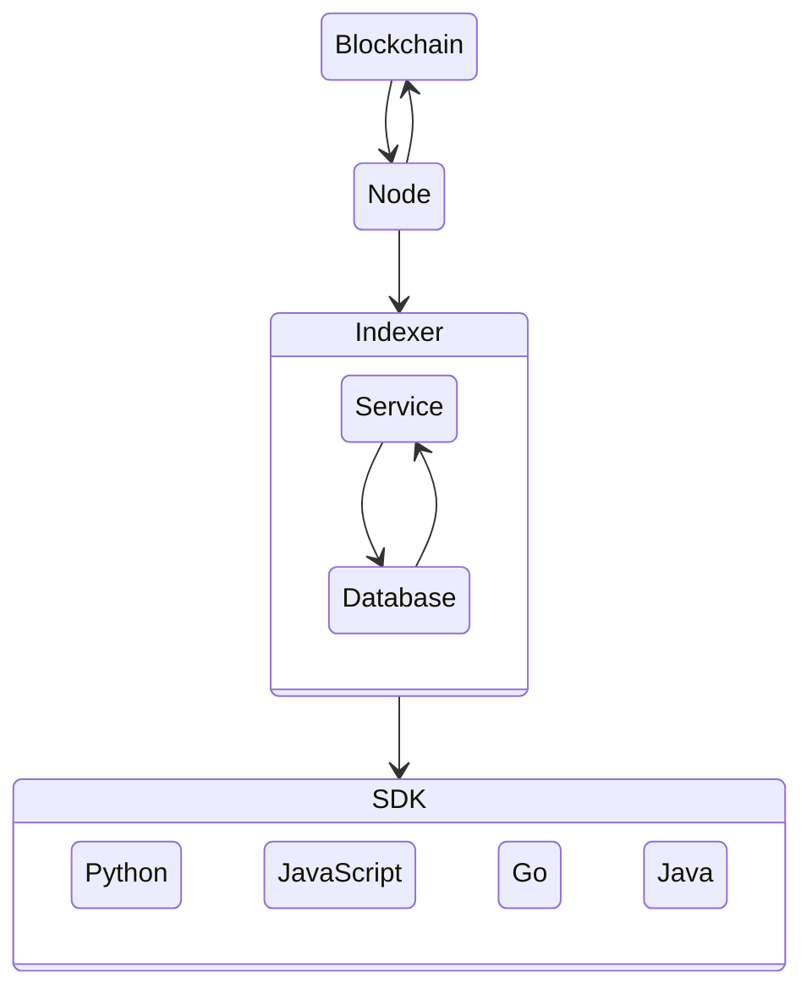

<div align="right">

  [](LICENSE.md)
  

</div>

---

<div>
    
    <h1 align="left">Algorand Node</h1>
    <h3 align="left">Block Foundation Docker Containers</h3>
</div>

---

<p align="center">
    
</p>


## Introduction

Welcome to the Block Foundation's Algorand Node Docker Image Repository, the hub for our endeavor in facilitating seamless, efficient, and secure deployment of an Algorand Node using Docker.

As part of our mission to revolutionize architecture and real-estate through blockchain technology, we recognize the importance of creating accessible and reliable resources for our community. In this repository, you'll find a Docker image designed specifically for running an Algorand Node, an integral part of the Algorand blockchain network.

For those new to the terminology, Docker is a platform that allows developers to automate the deployment, scaling, and management of applications. An Algorand Node, on the other hand, is a software application that interacts with the Algorand network to verify transactions and blocks. Combining the two provides a reliable, scalable, and easy-to-use way to participate in the Algorand network.

Our Docker image is built with a focus on ease-of-use, reliability, and security. It provides a ready-to-use environment for running an Algorand Node, eliminating the need for manual setup and configuration. It is perfect for developers who wish to experiment with the Algorand network or for those looking to contribute to the network by running a node.

This repository contains detailed instructions on how to use the Docker image, as well as the source code for the image itself. We encourage our community members to use this resource, provide feedback, and contribute to its ongoing improvement.

As with all our initiatives, this project is underpinned by our commitment to transparency, collaboration, and the democratization of technology. We're excited to share this work with you and look forward to seeing how it aids in your blockchain journey.

Thank you for joining us on this quest to reshape the future of architecture and real-estate through blockchain technology. Together, let's build a more sustainable, equitable, and innovative future.

## Network



## Quick Start

Run Algorand in a Docker container

### Build

``` sh
docker build -t algorand .
```

### Running

``` sh
docker run -d -p 8080:8080 --name algorand bjweaver/algorand-node
```

> To run on testnet:

``` sh
docker run -d -p 8080:8080 --name algorand bjweaver/algorand-node:testnet
```

### Status

> To obtain node status:

``` sh
docker exec algorand /algorand/node/goal node status -d /algorand/node/data
```

### API Connection

API will listen on `localhost:8080`

``` sh
curl 127.0.0.1:8080/swagger.json
```

## Resources

### Algorand

- [Algorand](https://www.algorand.com/)
- [Algorand | Developer](https://developer.algorand.org/)

#### Algorand SDK

- [Algorand SDK | Docs](https://py-algorand-sdk.readthedocs.io/en/latest/)
- [Algorand SDK | GitHub](https://github.com/algorand/py-algorand-sdk/)

#### Algorand Go

- [Algorand Go | GitHub](https://github.com/algorand/go-algorand)

#### AlgoDjango
- [AlgoDjango | Tutorial](https://developer.algorand.org/solutions/getting-started-with-python-algorand-sdk-and-django/)
- [AlgoDjango | GitHub](https://github.com/ipaleka/algodjango)

#### Algorand PyTeal

- [Algorand PyTeal](https://github.com/algorand/pyteal)
- [Algorand PyTeal | Utils](https://github.com/algorand/pyteal-utils)
- [Algorand PyTeal | Course](https://github.com/algorand-devrel/pyteal-course)

#### Algorand Sandbox

- [Algorand Sandbox](https://github.com/algorand/sandbox)

## Development

### Authors

This is an open-source project by the **[Block Foundation](https://www.blockfoundation.io "Block Foundation website")**.

The Block Foundation mission is enabling architects to take back initiative and contribute in solving the mismatch in housing through blockchain technology. Therefore the Block Foundation seeks to unschackle the traditional constraints and construct middle ground between rent and the rigidity of traditional mortgages.

website: [www.blockfoundation.io](https://www.blockfoundation.io "Block Foundation website")

### Contributing

We'd love for you to contribute and to make this project even better than it is today!
Please refer to the [contribution guidelines](.github/CONTRIBUTING.md) for information.

## Legal

### Copyright

Copyright &copy; 2023 [Block Foundation](https://www.blockfoundation.io/ "Block Foundation website"). All Rights Reserved.

### License

Except as otherwise noted, the content in this repository is licensed under the
[Creative Commons Attribution 4.0 International (CC BY 4.0) License](https://creativecommons.org/licenses/by/4.0/), and
code samples are licensed under the [MIT License](https://opensource.org/license/mit/).

Also see [LICENSE](https://github.com/block-foundation/community/blob/master/LICENSE) and [LICENSE-CODE](https://github.com/block-foundation/community/blob/master/LICENSE-CODE).

### Disclaimer

**THIS SOFTWARE IS PROVIDED AS IS WITHOUT WARRANTY OF ANY KIND, EITHER EXPRESS OR IMPLIED, INCLUDING ANY IMPLIED WARRANTIES OF FITNESS FOR A PARTICULAR PURPOSE, MERCHANTABILITY, OR NON-INFRINGEMENT.**
